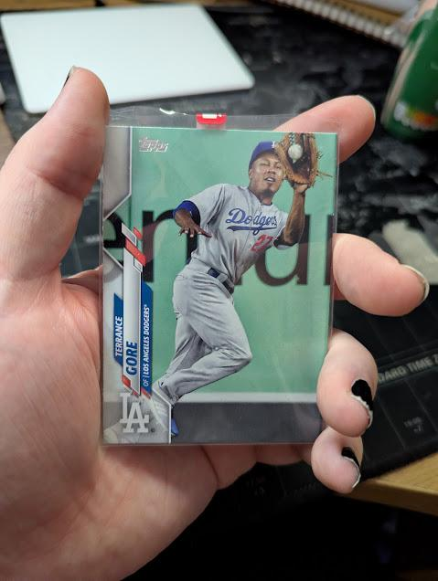

Terrance Gore passed away on February 6th 2026, aged 34, following complications from a routine surgery.

I've been meaning to write a proper blog post about his passing, got a draft or two kicking around that I haven't been happy with yet. 

I'm trying to balance writing a good enough tribute to the man himself, but also my fascination with the other one-tool running-only players (like the '70s Athletics squad with Herb Washington). Not quite found a way to figure that out...

As a Dodgers fan, I've got a small personal connection, as he was briefly one of ours in 2020...even if it was only for 2 regular season games!

In the mean-time, as a tribute to the king of speed and one of the most famous one-tool players, I've got his baseball card on my desk:

Rest In Peace Terrance
