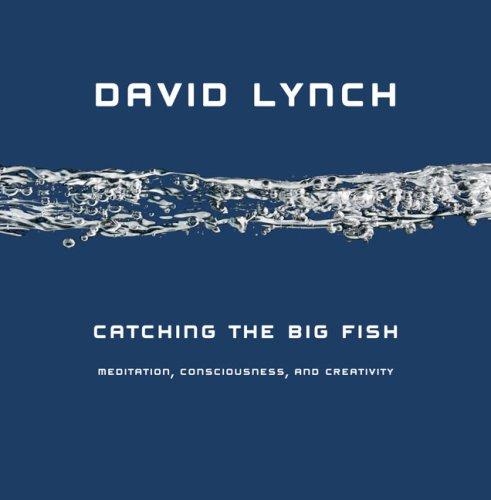

*Catching the Big Fish: Meditation, Consciousness, and Creativity* is a 2006 book by David Lynch.

There's a quote in it that I think about a lot:

> "In work and in life, we're all supposed to get along. We're supposed to have so much fun, like puppy dogs with our tails wagging. It's supposed to be great living; it's supposed to be fantastic."
> -- David Lynch
