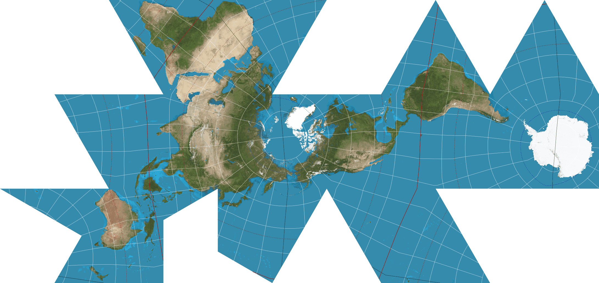

There's a scene in **The West Wing** ([Season 2, Episode 16: "Somebody's Going to Emergency, Somebody's Going to Jail"](https://www.imdb.com/title/tt0745679/) to be precise) where the fictional *Organisation of Cartographers for Social Equality* petitions the White House to mandate the [Peters projection](https://en.wikipedia.org/wiki/Gall%E2%80%93Peters_projection) in public schools:



They make the case that the [Mercator projection](https://en.wikipedia.org/wiki/Mercator_projection), the one most of us grew up with, is not as "correct" as one might think. In fact, it dramatically inflates the size of countries in the Global North: Greenland looks the same size as Africa, and of course, Europe sits confidently in the centre.

The whole thing is a quiet argument for a particular worldview, disguised as "objective" geometry.

It's played mostly for laughs (and West Wing has a tendency to do a bit of an "issue of the week" with these kind of side-plot stories) but the core point lands:

The map you grew up with taught you things about the world that aren't true, and you never noticed because the framing felt inevitable.

## The Dymaxion alternative

What inspired me to think about this and think about the scene from The West Wing originally was a YouTube short about the Dymaxion map:



Basically, a fellow called "Buckminster Fuller" took a different approach entirely. His Dymaxion map, first published in *Life* magazine in 1943 and refined with cartographer Shoji Sadao in 1954, projects the globe onto an icosahedron, a twenty-sided shape (D&D fans will recognise the d20). When you unfold it flat, you get this view of the globe...

*Image by [Justin Kunimune](https://commons.wikimedia.org/wiki/File:Dymaxion_projection.png), public domain. Earth imagery from NASA's Earth Observatory.*

It's a bit jarring after seeing globes and flattened maps all your life: oceans are interrupted, broken into odd gaps between triangular faces, with abrupt zig-zag seams everywhere.

**But**.. the continents are preserved whole, with remarkably little distortion of their actual shapes and sizes. It really helped me grok a concept I'd never really thought about, but one that instantly made sense when I saw things shown this way: [how early humans traversed the world and walked between continents](https://en.wikipedia.org/wiki/Early_human_migrations).

The main radical element of this way of looking at the world, at its core, is that there is no "right way up". Fuller argued that in the universe there is no up or down, no north or south, only "in" (toward gravitational centre) and "out" (away from it).

The orientation we're used to, with the Arctic at the top and Antarctica stretched along the bottom, is a *convention*, not a fact.

Where the West Wing scene says "Your map is biased," the Dymaxion map asks something more radical:

> **What if we stopped choosing a bias at all?**

## Projections everywhere

The reason this tickles my brain: it's another way framing determines how we see things, and a lot of framing is invisible to the people using it!

Map projections are a clean example because they're literal, and they're ingrained in your brain from the maps you've seen all your life. It's a situation where you can point at the distortion and measure it, but the same principle applies everywhere. The same awareness of bias works as a mental model for how teams work, how software should be structured, how problems should be decomposed. These are all projections too!

You preserve some things accurately at the cost of distorting others, and most of the time we don't notice because we've been looking at the same "map" our whole lives.

Fuller designed the Dymaxion map not because he thought it was the "correct" projection (NB: Like a lot of things, there isn't a perfect one!) but because he wanted people to see the earth as a single, connected system. He even called it...

## Spaceship Earth

A bit corny and on-the-nose but remember, this was in 1943... Personally I find it charming!

The point wasn't to replace one fixed view with another, it was to make the *act of choosing a view* visible.

That's the habit worth stealing I think: when something feels obvious, think about what made you *think* it's obvious. The shape of a team, the structure of a system, the "right" way to break down a problem. Stop a second and ask what "projection" you're looking at.

Most of the time you won't change the map. But at least you'll know it's a map.
