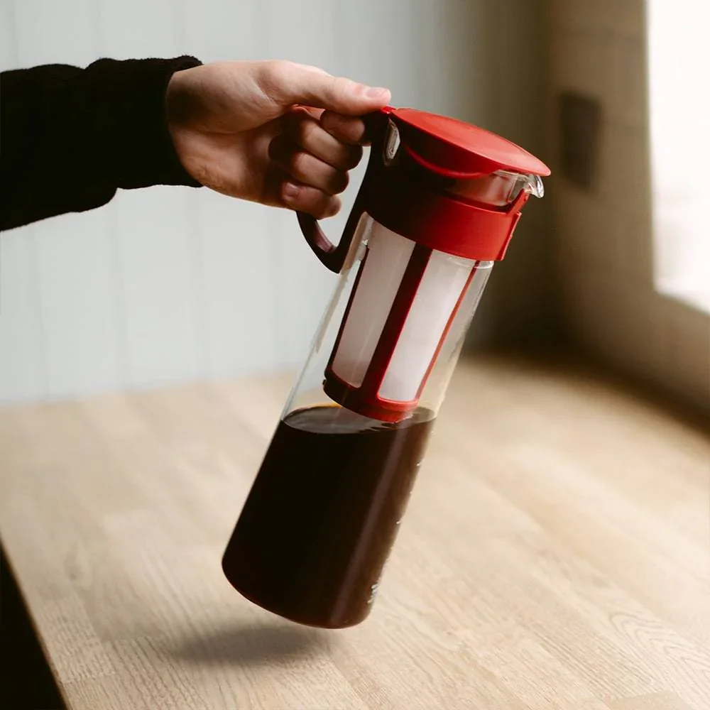

I learnt about the Japanese cold brew pot from a [Giant Bomb](https://www.giantbomb.com/) video back in the day.

It's one of those slow-drip towers where ice water drips through the grounds over a few hours. The result is incredibly smooth compared to just chucking grounds in a jar overnight.

Once I saw how it worked I had to get one. It's become my favourite way to make coffee at home.

It's the perfect way to make coffee for me. It's stronger, I can make a bunch at a time, and it's a lot less acidic so it goes down easier.
