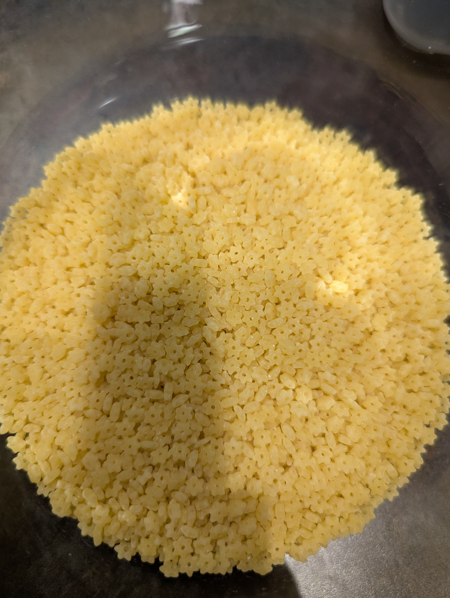
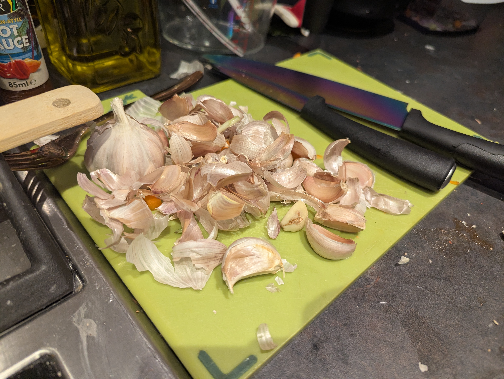
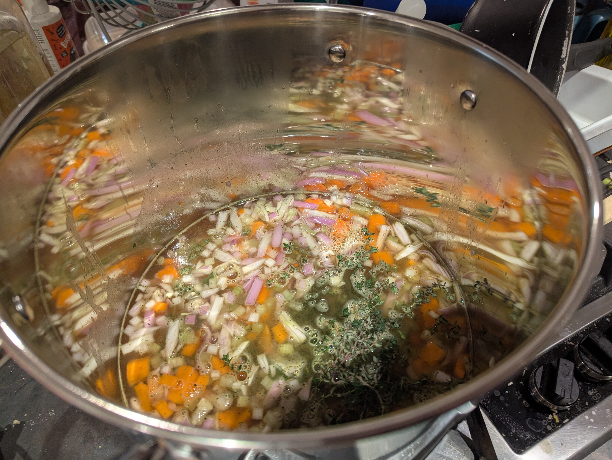
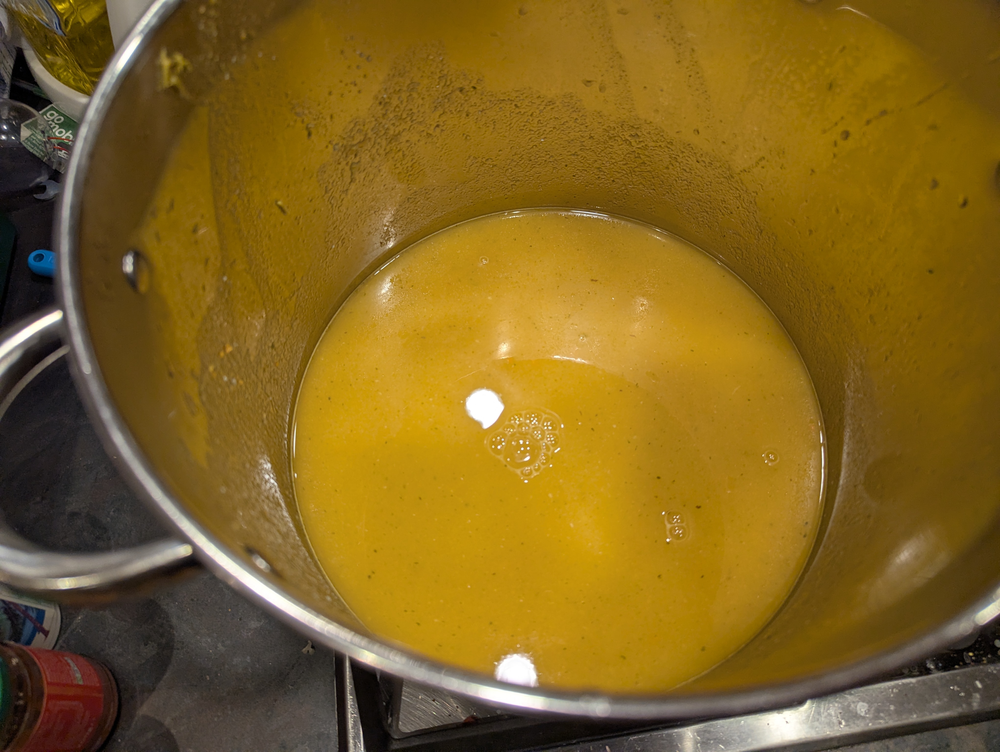
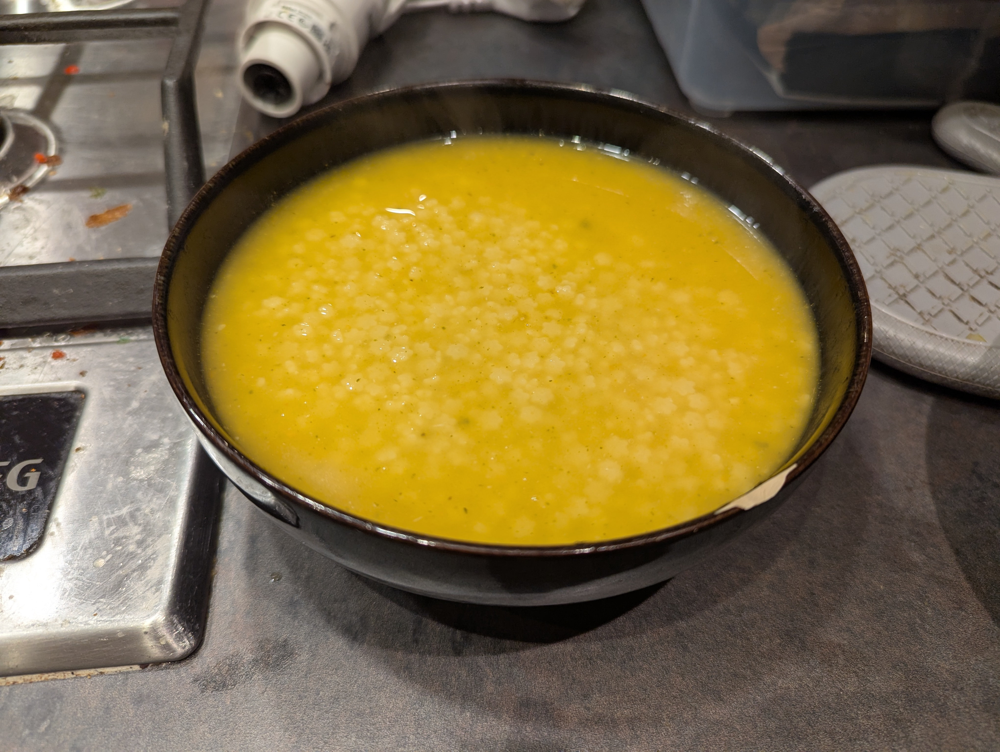
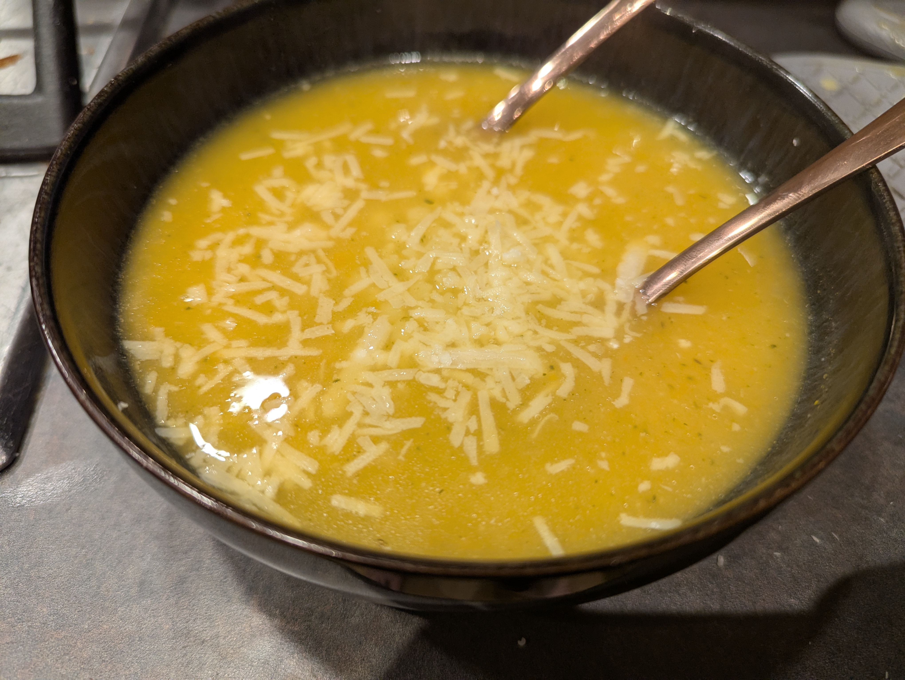
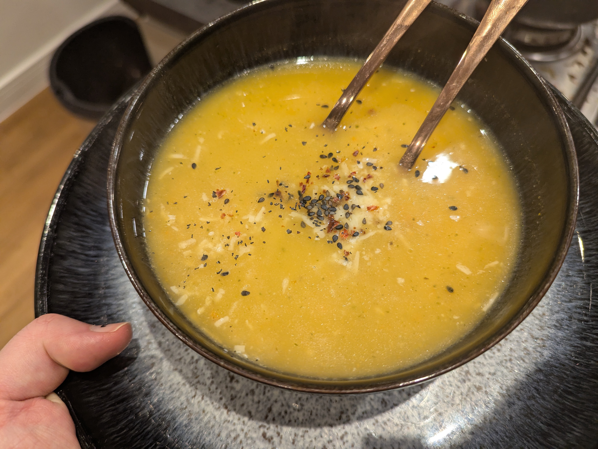
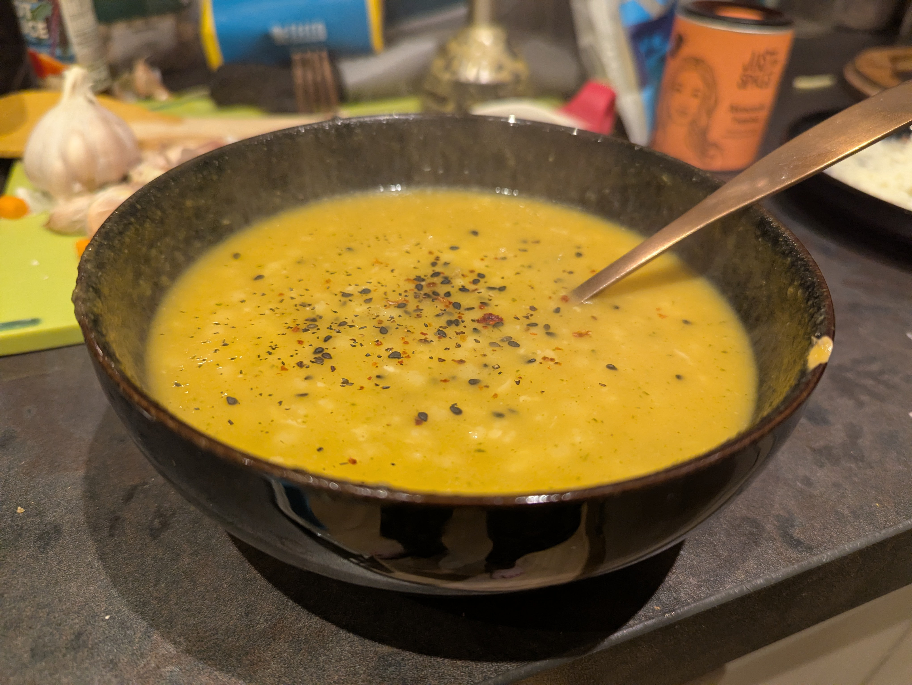

Italian Penicillin is the nickname for "Pastina"

I've been a little obsessed with it recently

There's something about the little pastina stars floating in a satisfying broth that tickles the good parts of my brain.

The recipe is pretty foolproof as well. [This one from AllRecipes](https://www.allrecipes.com/italian-penicillin-soup-recipe-8751324) is the one I mostly use, but I tweak things depending on what I have.

Garlic, onion, carrots, celery.

Thyme, Bay Leaf, Stock.

Cook the veggies til soft.

Blend them to a smooth soup.

Then throw in a parmesan rind, and cook whatever small pasta you have until al dente.

Pastina are harder to find at supermarkets but I bought them online cos I love the little flowers.

It works with orzo as well.

Then you just have a super satisfying, filling soup. Throw in some chicken, serve it with bread.

It's great!

