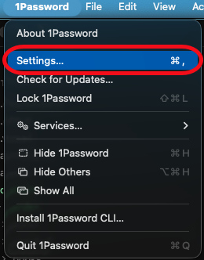
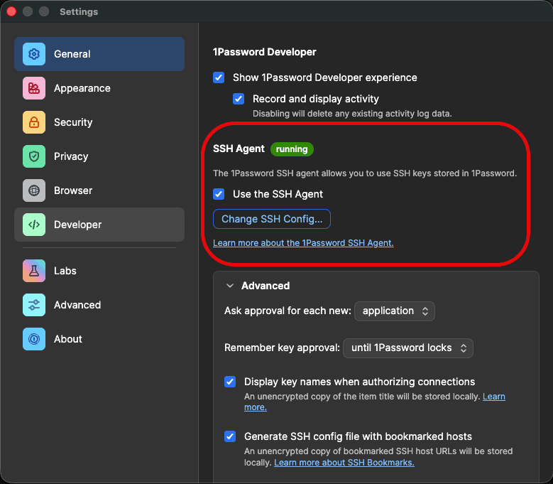
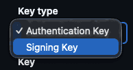

Letting 1Password run your SSH agent is neat! It'll hold holds your keys, and prompts you to authorise each use pretty seamlesly with your password or thumbprint.

For the usecase we'll be talking about here, we can use it to be a git commit signer. For me, this was way easier than the setup I had before: No GPG, no having to add an `ssh-agent` call to your shell's startup prompt, and having to type a password to use a protected key every single time and so on.

This is how it's done...

## Enable the 1Password SSH Agent

Open 1Password's settings:



Then look at the Developer section for the SSH Agent setting:



If it says `running` next to `SSH Agent`, you're golden!

## Get (or Create) an SSH Key

Two options here:

* **Generate one inside 1Password** (my preferred): in 1Password, create a new SSH Key item and let 1Password generate the key pair for you. The private key never touches disk, it lives in the vault. This is the cleanest option if you're going all-in on 1Password.
* **Use a key that's already on disk**: you probably already have one at `~/.ssh/id_ed25519.pub`. If you don't, `ssh-keygen -t ed25519` will sort you out. You can then drag the private key into 1Password after the fact, or just leave it where it is and let 1Password's agent pick it up.

Either way, grab the public key (1Password has a "Copy public key" action on the item; for a disk key it's just the contents of the `.pub` file) and [add a new signing key on GitHub](https://github.com/settings/ssh/new).

Important bit: click the **Key Type** dropdown and pick `Signing Key`, not `Authentication Key`:



(It's the same key material, different role here)

## `.gitconfig` Setup

There are two ways to wire this up: let 1Password generate the config for you (what I do), or write it by hand.

### Option 1: Let 1Password Generate It

Open the SSH Key item in 1Password and hit the "Configure Git Commit Signing" option. It writes a file to `~/.config/1password/gitconfig` that looks roughly like:

```ini
[user]
    email = you@users.noreply.github.com
    name = Your Name
    signingkey = ssh-ed25519 AAAAC3Nz... your-key-comment
[gpg]
    format = ssh
[gpg "ssh"]
    program = "/Applications/1Password.app/Contents/MacOS/op-ssh-sign"
[commit]
    gpgsign = true
[tag]
    forceSignAnnotated = true
    gpgsign = true
```

Then pull it into your main `~/.gitconfig` via an include:

```ini
[include]
    path = ~/.config/1password/gitconfig
```

The magic line is `gpg.ssh.program`. `op-ssh-sign` is 1Password's signing helper, and it's what lets git sign commits without ever pulling the private key out of the vault.

### Option 2: Do It By Hand

If you'd rather keep everything in one file, drop this into `~/.gitconfig` directly:

```ini
[user]
    email = <your email>
    name = <your name>
    signingkey = ~/.ssh/id_ed25519.pub
[commit]
    gpgsign = true
[tag]
    forceSignAnnotated = true
    gpgsign = true
[gpg]
    format = ssh
[gpg "ssh"]
    program = "/Applications/1Password.app/Contents/MacOS/op-ssh-sign"
```


A quick note on `signingkey`: git accepts either a path to a public key file (what's shown above), or the literal public key prefixed with `key::` (like `key::ssh-ed25519 AAAA...`). If you look at the file 1Password generates, it uses the raw `ssh-ed25519 AAAA...` form with no prefix, which also works. The [git docs](https://git-scm.com/docs/git-config#Documentation/git-config.txt-usersigningKey) call that form deprecated but it's still tolerated for backward compat, hence 1Password's choice.


For the email, I've switched to using [the Github `noreply` option](https://docs.github.com/en/account-and-profile/reference/email-addresses-reference#your-noreply-email-address). For me that's `petems@users.noreply.github.com`, but they've recently added an option to hide your email address completely as well:


Push a test commit somewhere and check for the little `Verified` badge next to it on GitHub:


Boom, done!

## Troubleshooting

If it doesn't seem to be signing, run:

```bash
git log --show-signature -1
```

If you get `error: gpg.ssh.allowedSignersFile needs to be configured and exist for ssh signature verification`, create `~/.config/git/allowed_signers` with a line like:

```text
your-email ssh-public-key-name ssh-public-key
```

Then tell git about it:

```bash
git config --global gpg.ssh.allowedSignersFile ~/.config/git/allowed_signers
```

That should fit it!

## Bonus: Use 1Password as Your Full SSH Agent

Strictly, you don't need this bit for commit signing. The `op-ssh-sign` helper we set up in the `.gitconfig` talks to 1Password directly, it doesn't read `SSH_AUTH_SOCK` at all. [1Password's docs say so themselves](https://developer.1password.com/docs/ssh/git-commit-signing/):

> Set `gpg.ssh.program` to the SSH signer binary provided by 1Password, so you don't have to set `SSH_AUTH_SOCK` yourself.

So if all you want is signed commits, you can stop reading now.

But most of us use SSH for plenty of other things: `ssh user@host`, pushing over `git+ssh`, GUI SSH clients like Termius, forwarding an agent into a dev container or a remote VM. All of those read `SSH_AUTH_SOCK` to find an agent. Point that variable at the 1Password socket and those tools transparently use your 1Password-held keys too, with the same authorise-with-Touch-ID prompt you get for commits.

1Password's docs have a [LaunchAgent plist](https://developer.1password.com/docs/ssh/agent/compatibility/#configure-ssh_auth_sock-globally-for-every-client) that wires it up on boot:

```bash
mkdir -p ~/Library/LaunchAgents
cat << EOF > ~/Library/LaunchAgents/com.1password.SSH_AUTH_SOCK.plist
<?xml version="1.0" encoding="UTF-8"?>
<!DOCTYPE plist PUBLIC "-//Apple//DTD PLIST 1.0//EN" "http://www.apple.com/DTDs/PropertyList-1.0.dtd">
<plist version="1.0">
<dict>
  <key>Label</key>
  <string>com.1password.SSH_AUTH_SOCK</string>
  <key>ProgramArguments</key>
  <array>
    <string>/bin/sh</string>
    <string>-c</string>
    <string>/bin/ln -sf \$HOME/Library/Group\ Containers/2BUA8C4S2C.com.1password/t/agent.sock \$SSH_AUTH_SOCK</string>
  </array>
  <key>RunAtLoad</key>
  <true/>
</dict>
</plist>
EOF
launchctl load -w ~/Library/LaunchAgents/com.1password.SSH_AUTH_SOCK.plist
```

## References

### GitHub Docs

* [Signing commits](https://docs.github.com/en/authentication/managing-commit-signature-verification/signing-commits)
* [About commit signature verification](https://docs.github.com/en/authentication/managing-commit-signature-verification/about-commit-signature-verification)

### 1Password

* [Sign Git commits with SSH (1Password Developer docs)](https://developer.1password.com/docs/ssh/git-commit-signing/)
* [Sign your Git commits with 1Password (1Password blog, Sep 2022)](https://1password.com/blog/git-commit-signing)

### Why Sign at All

* [Signing Git Commits With Your SSH Key, Caleb Hearth](https://calebhearth.com/sign-git-with-ssh)
