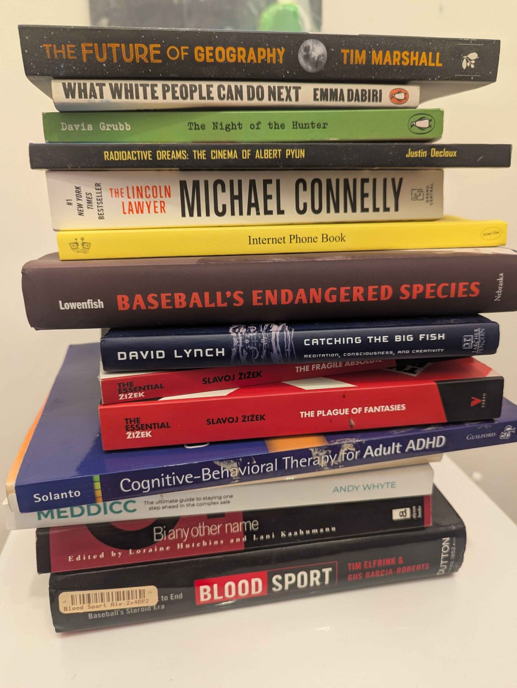

I'm someone who reads a lot, travels and often jumps between books depending on my mood.

This means I generally buy books digitally where possible.

However, sometimes there's a read thats physical only, or an author that specifically asked for people to buy it physically, or a spontanious purchase in an airport bookshop, because the one time I got stuck in a queue in Vegas for 2 hours, and the CBP guy wouldn't let anyone use anything electronic, even a Kindle on airplane mode.

So, I have a pile of shame of physical books I need to get back to. So I'm posting them here to make myself go back and read them:

- [ ] [The Future of Geography](https://www.goodreads.com/book/show/62675564-the-future-of-geography) - Tim Marshall
- [ ] [What White People Can Do Next](https://www.goodreads.com/book/show/55921521-what-white-people-can-do-next) - Emma Dabiri
- [ ] [Radioactive Dreams: The Cinema of Albert Pyun](https://www.goodreads.com/book/show/49971005-radioactive-dreams) - Justin Decloux
- [ ] [The Lincoln Lawyer](https://www.goodreads.com/book/show/40612032-the-lincoln-lawyer) - Michael Connelly
- [ ] [Baseball's Endangered Species](https://www.goodreads.com/book/show/62594469-baseball-s-endangered-species) - Lee Lowenfish
- [x] [Catching the Big Fish](https://www.goodreads.com/book/show/58169.Catching_the_Big_Fish) - David Lynch *(March 18, 2026)*
- [ ] [The Plague of Fantasies](https://www.goodreads.com/book/show/243947) - Slavoj Žižek
- [ ] [Cognitive-Behavioral Therapy for Adult ADHD](https://www.goodreads.com/book/show/21979363) - J. Russell Ramsay & Anthony L. Rostain
- [ ] [By Any Other Name](https://www.goodreads.com/book/show/203337138-by-any-other-name) - Jodi Picoult
- [ ] [Blood Sport](https://www.goodreads.com/book/show/20534300-blood-sport) - Tim Elfrink & Gus Garcia-Roberts

> NB: I should move these to Hardcover.app links...
