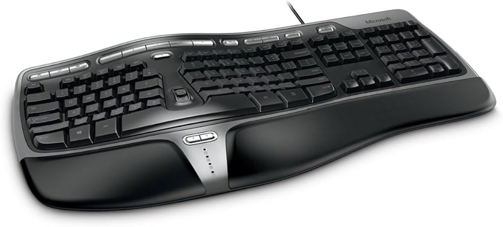
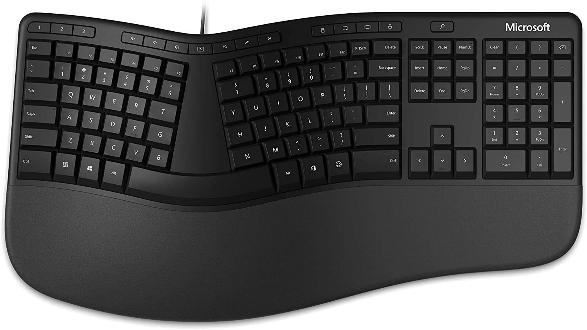
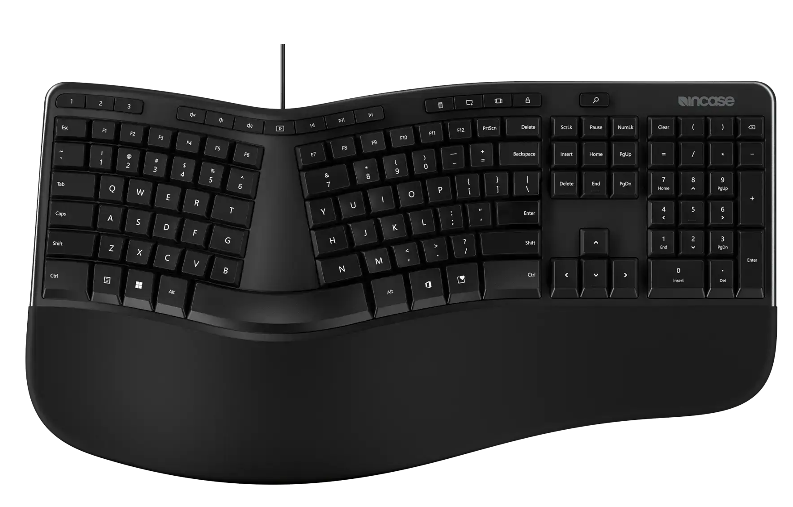
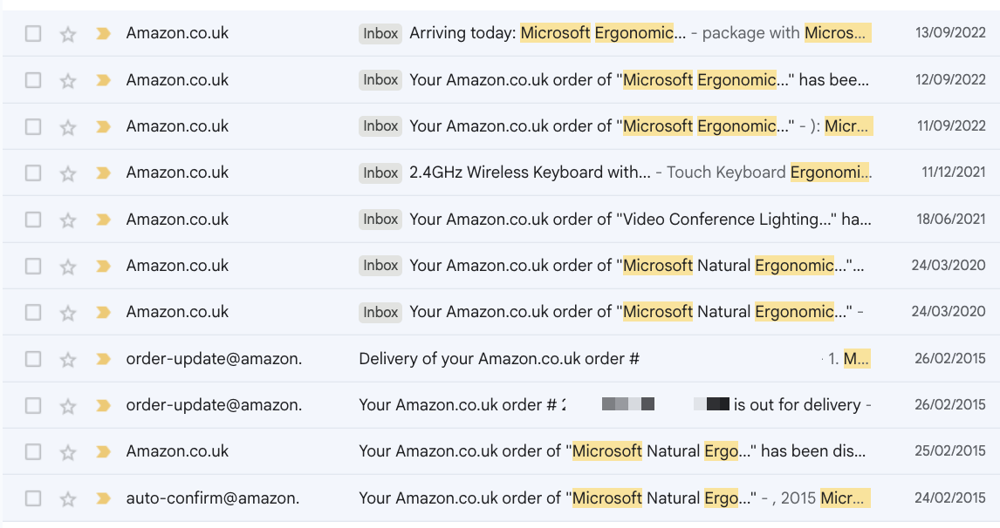
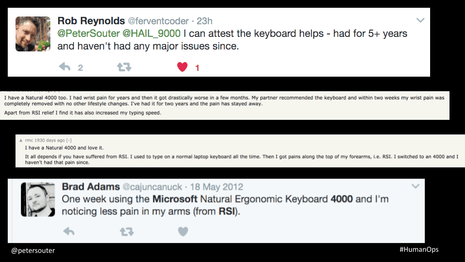

In my humble opinion, Microsoft doesn't get nearly enough credit for hardware.

*\[...awkward silence...\]*

Ok, let me start again: Microsoft doesn't get enough credit for their **computer accessories hardware**. Let's forget about a lot of their other output (The [Zune](https://slate.com/technology/2012/10/microsoft-zune-how-one-of-the-biggest-flops-in-tech-history-helped-revive-a-great-american-tech-company.html), [Surface RT](https://www.huffingtonpost.co.uk/entry/microsoft-surface-rt-900-million_n_3624014) and the [OG Xbox Duke controller](https://www.engadget.com/2018-03-23-xbox-controller-retrospective-hyperkin-duke-gamepad.html) were all pretty big flops)

Quietly Microsoft has been a dark-horse excellent mice and keyboard maker. I could wax lyrical about things like the IntelliMouse (which IMO was way ahead of its time!), but today I'm going to shout out the secret MVP of the Microsoft hardware world. What the fans like to call "The Ergo 4000".

## An Easy Way For Happy Wrists

Many moons ago, like a lot of people who spend their days at a computer, I started to get wrist tingles. Those tingles started to develop into discomfort and then even pain. I'd heard horror stories from friends and colleagues about getting RSI as a developer and how difficult it made things for them, so I sprung into action!

I consulted the wisdom of the internet and I was surprised by how many people waxed lyrical about the Microsoft's offering to help here. The **Microsoft Natural Ergonomic Keyboard 4000**.

So I got one!

The 4000 had some really good innings (2005-2019, 14 years!) and has various successors after that, the main one being the confusingly un-numbered "Microsoft Ergonomic Keyboard" (ie. sans the futuristic 4000 numbering):

I was actually pretty sad to find out, as I was researching this post, that Microsoft fully packed-in their accessories hardware department in 2024! Disaster!

However, all is not lost. It lives on through a [partnership with InCase](https://www.theverge.com/2024/1/5/24026323/microsoft-incase-partnership-keyboards-accessories-partnership).

So now, if you want one you'll be looking for an **"Incase Designed by Microsoft™ Ergonomic Keyboard**:

<https://www.incase.com/products/ergonomic-keyboard>

## Why It's So Good

But Peter, you cry, it looks just like a boring keyboard you see in any office?

Yes, and that's the beauty of it! It's simple and it works, there's a reason it's so common in the blue-collar world!

Now don't get me wrong, I love a fancy keyboard. My main daily-driver for my work setup is a [NocFree](/garden/workstation/nocfree/). In comparison, the MS Ergo keyboards are pretty drab. It's not flashy, it doesn't have hot-swap switches, there's no per-key RGB or fancy macros. It's just a solid, functional, reasonably-priced ergonomic keyboard that does exactly what it says on the tin.

But **its simplicity is its strength**. The curved split layout keeps your wrists at a more natural angle than a flat slab keyboard _but_ it's not such an extreme split as other keyboards, plus the keys are in familiar places and it comes in one piece, which is essential for me as I find full splits drift over time and I fiddle with them. Plus its little leatherette built-in palm rest is super comfortable!

It Just Works™

## If It Aint Broke

At this point I think I must've bought half a dozen of it and its various successors. Not because it broke down, far from it! I found myself gifting it to friends and family members who complained about wrist issues, for desks and workstations at companies I worked at where I often left it behind when I left, and... yes, sometimes as a refresh when previous ones started to get a little worn down. Although looking through my email archives, my first purchase of one was in 2015, and that one was a workhorse that lasted 5 years it seems!

NB: Not gonna lie, the new foam style they switched to from the original leatherette material was a great change - That would get little grody and flaky over time!

Essentially, it's low-cost, low-faff, low-adjustment-requirement way to make your desk setup a bit healthier, that's hard to argue with for me.

The main knock against it is that it looks a bit corporate and boring, especially the 4000 which had some admittedly pretty ugly metallic colouring on its macro buttons. But a lot of that has been fixed with the successors, and I think the current all-black-with-foam iteration actually looks pretty slick, albeit still way more conventional and boring than the average cool-kids gaming setup.

Honestly, sometimes boring and functional is the right call.

## Don't Take My Word For It

Don't believe me? I come with receipts!

Just google "Microsoft Ergonomic 4000" and you will find plenty of evangelists for it and its descendants.

Just in a quick look now researching this post, I found a blog post from 2005 by [Jeff Atwood of Stack Overflow fame recommending it](https://blog.codinghorror.com/keyboarding-microsoft-natural-ergonomic-4000/), numerous [Hacker News comments](https://news.ycombinator.com/item?id=9332835), [Reddit threads](https://www.reddit.com/r/pcmasterrace/comments/1d0dmio/why_is_my_beloved_microsoft_ergonomic_keyboard/) and even a [Lifehacker post](https://lifehacker.com/microsoft-comfort-curve-keyboard-3000-helps-your-rsi-fo-5818254).

I even gave a talk at a meetup called #HumanOps way back in 2017, where I talked about ergonomics, and looking through those slides I had one where I had a bunch of screenshots of people singing its praises:

Source: <https://www.slideshare.net/slideshow/maintaining-layer-8-75196679/75196679>

## A Timeless Classic

In conclusion, we come here to raise a toast to Microsoft's Little Ergo Keyboard That Could, and hopefully I've convinced you to give one a shot!
