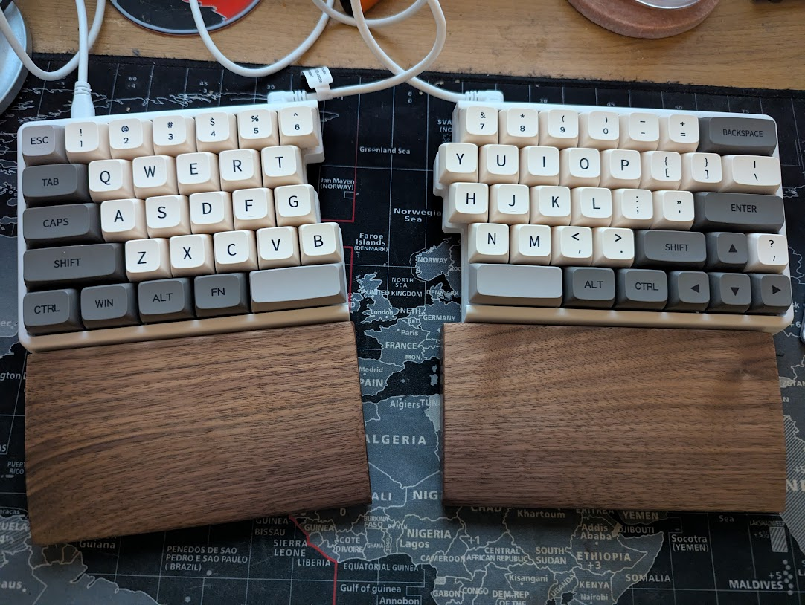
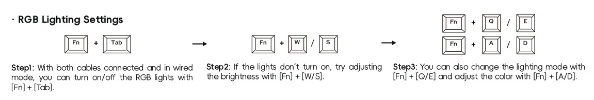
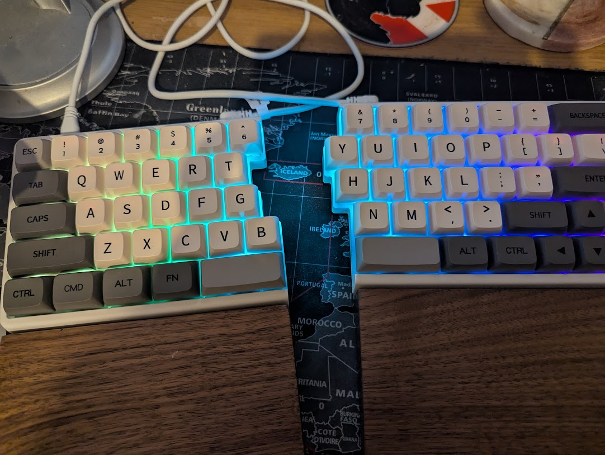

The [NocFree](https://www.nocfree.com/) is a split keyboard I bought and I really like it.

I'd been curious about split keyboards for a while and this one hit the sweet spot for me. It took a bit of getting used to, but once the muscle memory kicked in it felt way more natural than a standard layout.

The RGB shortcuts I actually use:

* `Fn` + `Tab` — toggle RGB lights on/off (both cables need to be connected, wired mode)
* `Fn` + `W` / `S` — adjust brightness up/down
* `Fn` + `Q` / `E` — change lighting mode
* `Fn` + `A` / `D` — change colour

