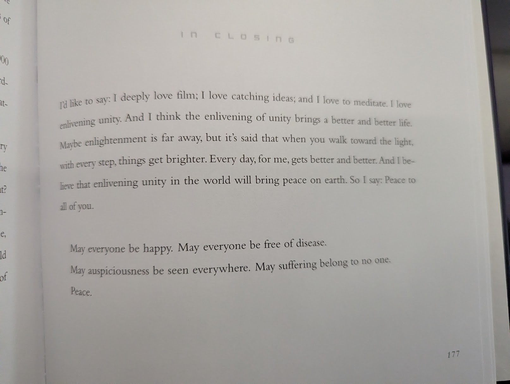

+++
author = "Peter Souter"
categories = ["Personal", "Blogging"]
date = 2026-04-02
description = "A quick April check-in: digital gardens, AI-assisted editing, and rediscovering the joy of reading."
draft = false
slug = "april-update-gardens-grass-and-big-fish"
tags = ["Blogging", "Digital Garden", "Reading", "AI", "Personal"]
title = "April Update: Gardens, Grass, and Big Fish"
keywords = ["digital garden", "blogging", "david lynch", "catching the big fish", "claude skills", "reading"]

[cover]
image = "cover_unsplash-HsNSeKm7qw0.jpg"
alt = "A colorful fish with blue spots and yellow belly."
caption = "Photo by [The New York Public Library](https://unsplash.com/@nypl?utm_source=unsplash_mcp&utm_medium=referral) on [Unsplash](https://unsplash.com/photos/a-colorful-fish-with-blue-spots-and-yellow-belly-HsNSeKm7qw0?utm_source=unsplash_mcp&utm_medium=referral)"
+++

Quick update from me! I've not got a big thesis or a grand narrative this time round, just a few things I've been up to since March.

<!--more-->

## The Garden is Growing

I mentioned in my [last ramble](/post/i-failed-but-feel-good/) that I wanted a place for all those smaller ideas that don't warrant a full blog post. Well, I went and built it: a [garden section](/garden/) on the site.

I've written a [longer post about the thinking behind it](/post/my-little-thoughts-garden/), but the short version is: I had all these seedlings rattling around in my notes — recommendations, half-formed opinions, lists of things I like — and they were just sitting there doing nothing. The garden gives them somewhere to live and breathe without the pressure of being a Proper Post&trade;.

It's been surprisingly satisfying for such a simple idea. Some of them might grow into full blog posts eventually, some are just a paragraph that I wanted to get out of my head, and that's completely fine. It's scratching that itch of wanting to write something down without building an entire article around it.

I'm trying to punch through that overthinking and just Get Stuff Done and this makes it super easy.

## Claude Skills as a Blog Editor

I've been experimenting with using Claude Code's [Skills](https://docs.anthropic.com/en/docs/claude-code/skills) feature to help with the blogging process. Specifically, I've set up a couple of custom skills that act as editorial reviewers for my posts — one for [technical content](https://github.com/petems/petersouter.xyz/tree/master/.claude/skills/tech-blog-editor) and one for [personal/non-tech posts](https://github.com/petems/petersouter.xyz/tree/master/.claude/skills/non-tech-blog-editor).

I've already used it to review one of my recent posts, and it was genuinely useful. It caught some silly mistakes I'd missed, but also gave some more thoughtful structural feedback that made me reconsider how I'd framed a few sections.

Using AI as a *proofreader* and *editor* feels very different from using it as a *writer*. A second pair of eyes seems like the best way to make sure the voice is still mine, but still getting a nudge on the bits where I've been sloppy or unclear.

Early days but it feels like a much healthier use of the tools than the GenAI scope-creep spiral I fell into back in February.

## Touching Grass and Catching Big Fish

Honestly? I've not got much else to blog about because I've been touching grass more. And that's a good thing!

I've been reading more, especially shorter, more personal books. The standout recently has been David Lynch's [*Catching the Big Fish: Meditation, Consciousness, and Creativity*](https://hardcover.app/books/catching-the-big-fish).

It's just a bunch of short paragraphs about his craft, his motivations and the people he's worked with. I was stuck on a train, I'd brought it along with me, train got delayed, finished it in an hour!

Was a nice warm feeling on a morning commute, and it helped me cross off something from my [pile of shame](/garden/books/pile-of-shame/), what beats that?

Plus I'm a big softie and the final page was this: 

He got me hook, line, and sinker on that.

Like a fish one could say! 

## That's It, Really

Told you it was a quick one. Garden's growing, AI's editing, grass is being touched, books are being read. See you in the next one!
